# Point-API项目

> 作者：[point](https://github.com/point610)

## 项目介绍

基于 React + Spring Boot + Dubbo + Gateway 的 API 接口开放调用平台。

管理员可以接入并发布接口，可视化各接口调用情况。

用户可以开通接口调用权限、浏览接口及在线调试，并通过客户端 SDK 轻松调用接口。

##### 😀用户

- 注册成为网站用户
- 浏览和搜索想要的接口
- 申请接口调用
- 在线调用接口，验证结果

##### 😀开发者

- 使用提供的客户端SDK: [POINT-API-SDK](https://github.com/point610/point-api-sdk)
- 复制开发者凭证，配置SDK，将接口集成到项目中
- 阅读API在线文档

## 项目导航 🧭

- **[POINT-API 前端，web模块，网关模块，接口模块](https://github.com/point610/point-api)**
- **[POINT-API-SDK️](https://github.com/point610/point-api-sdk)**
- **[POINT-API 在线平台](http://124.71.42.27/user/login)**

## 目录结构 📑

| 目录                                                                                               | 描述     |
|--------------------------------------------------------------------------------------------------|--------|
| **[point-api-backend](https://github.com/point610/point-api/tree/master/point-api-backend)**     | 后端模块   |
| **[point-api-front](https://github.com/point610/point-api/tree/master/point-api-front)**         | 前端模块   |
| **[point-api-common](https://github.com/point610/point-api/tree/master/point-api-common)**       | 公共模块   |
| **[point-api-gateway](https://github.com/point610/point-api/tree/master/point-api-gateway)**     | 网关模块   |
| **[point-api-interface](https://github.com/point610/point-api/tree/master/point-api-interface)** | 接口模块   |
| **[point-api-sdk](https://github.com/point610/point-api/tree/master/point-api-sdk)**             | SDK模块  |
| **[point-api-sdk-demo](https://github.com/point610/point-api/tree/master/demo)**                 | 调用Demo |

## 项目架构 🗺️

#### 总体

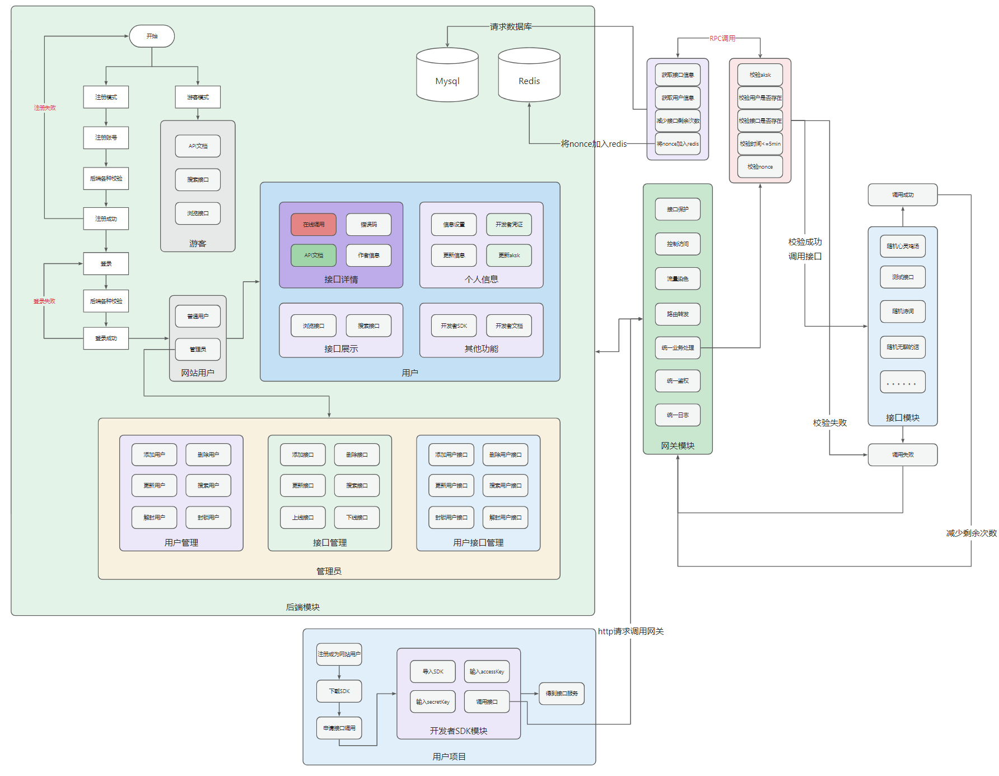

#### gateway模块

#### interface模块

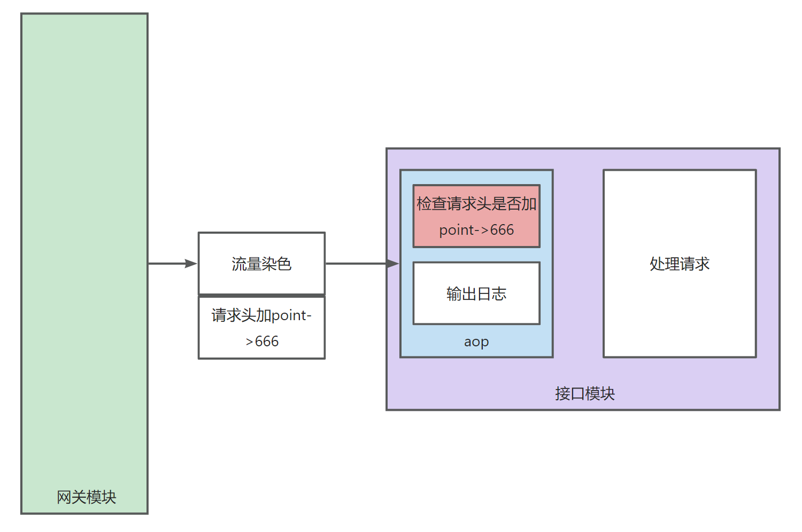

## 项目选型 🎯

#### 后端

- Spring Boot 2.7.0
- Spring MVC
- MySQL 数据库
- 免费free-img组件模块
- API 签名认证（Http 调用）
- Spring Session Redis 分布式登录
- Dubbo 分布式（RPC、Nacos）
- MyBatis-Plus 及 MyBatis X 自动生成
- Spring Cloud Gateway 微服务网关
- Swagger + Knife4j 接口文档
- Spring Boot Starter（SDK 开发）
- Apache Commons Lang3 工具类
- Hutool、Apache Common Utils、Gson 等工具库

#### 前端

- React 18
- Ant Design Pro 5.x 脚手架
- OpenAPI 前端代码生成
- Umi 4 前端框架
- Ant Design & Procomponents 组件库

## 功能介绍 📋

| **项目功能**                                                          | 游客 | **用户** | **管理员** |
|-------------------------------------------------------------------|----|--------|---------|
| [**POINT-API-SDK**️](https://github.com/point610/point-api-sdk)下载 | ✅  | ✅      | ✅       |
| 申请接口调用                                                            | ❌  | ✅      | ✅       |
| 在线调试接口                                                            | ❌  | ✅      | ✅       |
| 搜索接口                                                              | ✅  | ✅      | ✅       |
| 更新个人信息                                                            | ❌  | ✅      | ✅       |
| 获取开发者凭证                                                           | ❌  | ✅      | ✅       |
| [**POINT-API-SDK**️](https://github.com/point610/point-api-sdk)使用 | ❌  | ✅      | ✅       |
| 更新头像                                                              | ❌  | ✅      | ✅       |
| 用户管理                                                              | ❌  | ❌      | ✅       |
| 接口管理、接口上线、下线                                                      | ❌  | ❌      | ✅       |
| 用户接口管理，禁止用户调用接口                                                   | ❌  | ❌      | ✅       |

## 功能展示 ✨
#### 登录
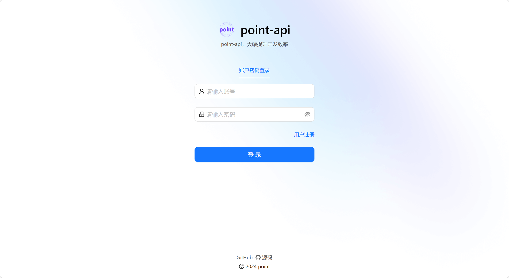

#### 注册
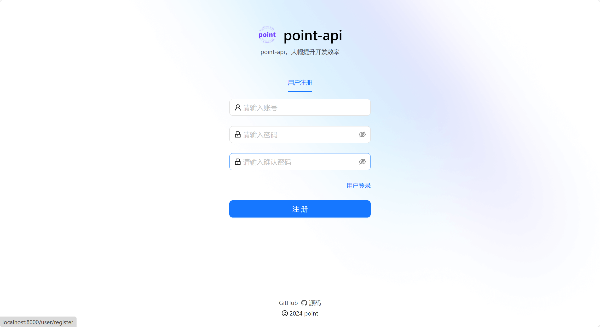

#### 首页
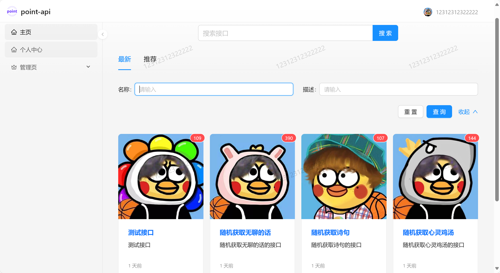

#### 接口信息
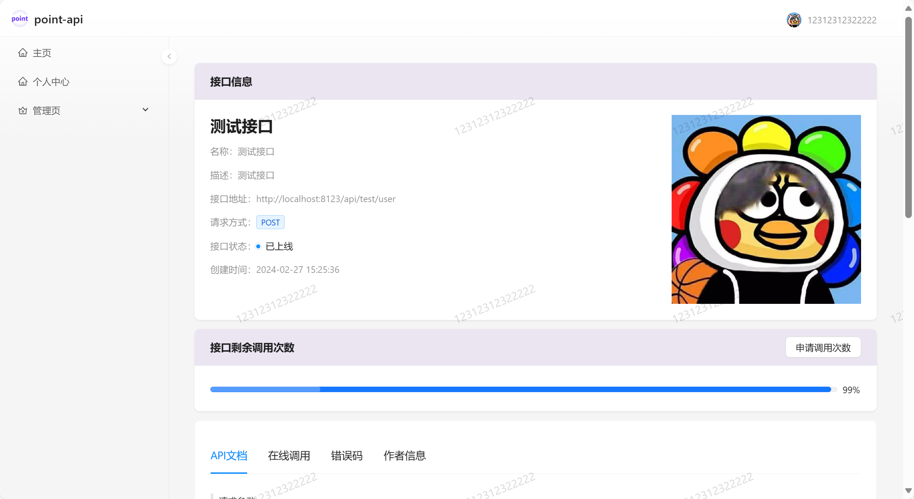

#### API文档
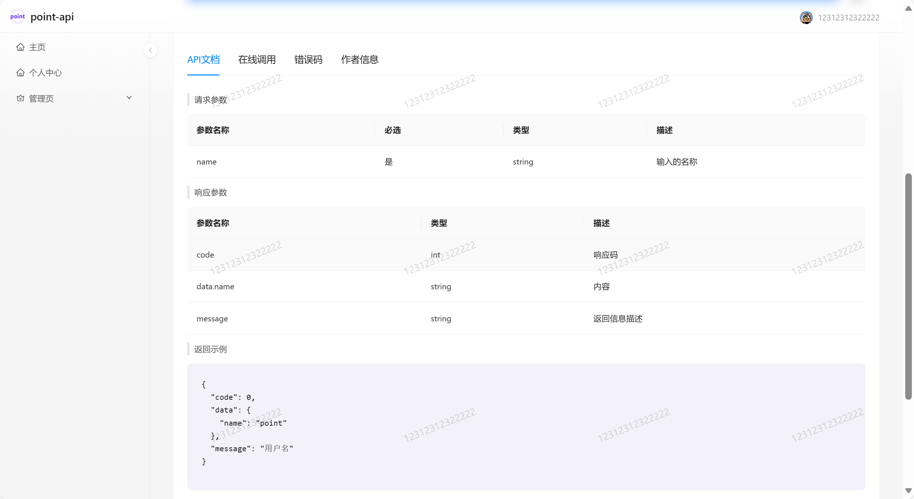

#### 在线调用
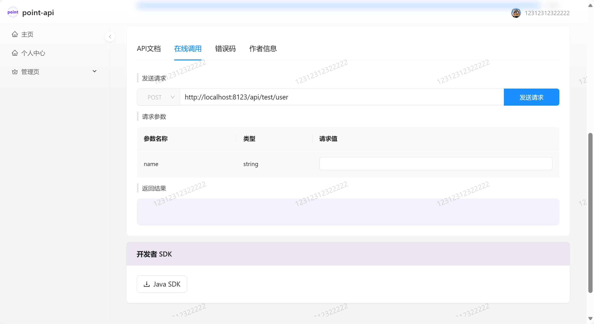

#### 错误码
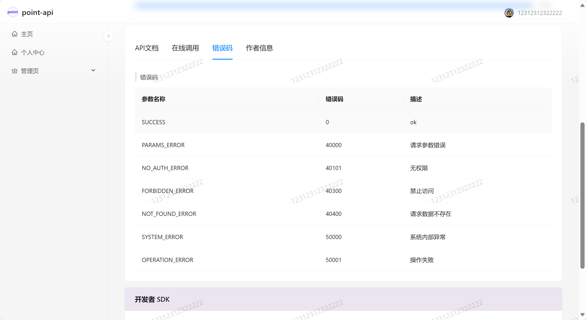

#### 用户管理
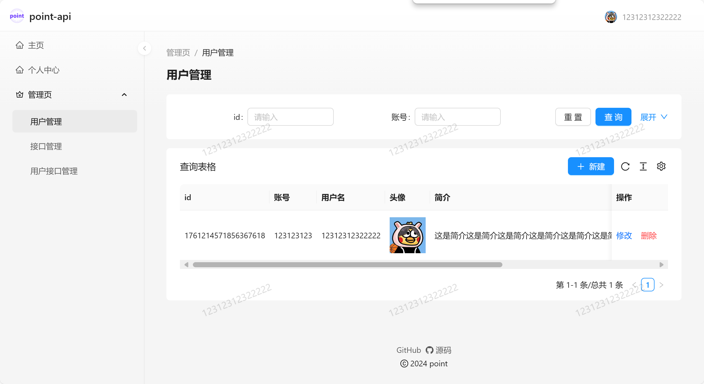

#### 接口管理
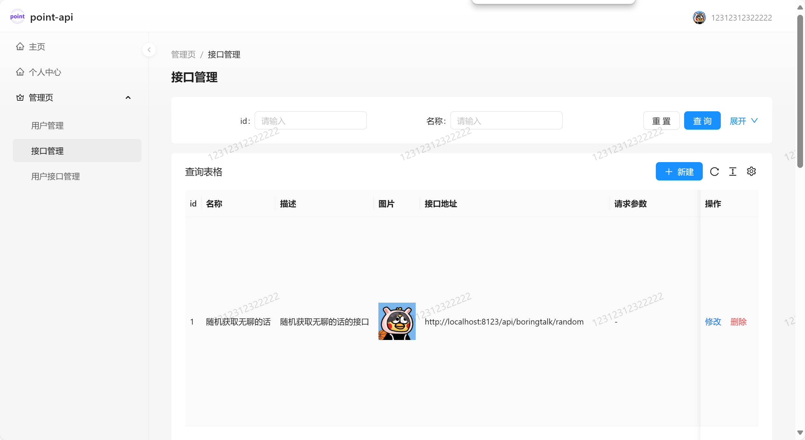

#### 用户接口管理
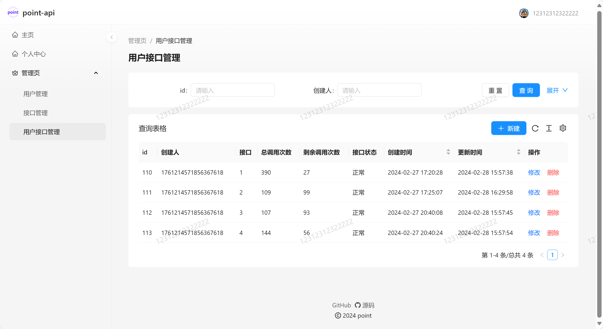

#### 个人信息
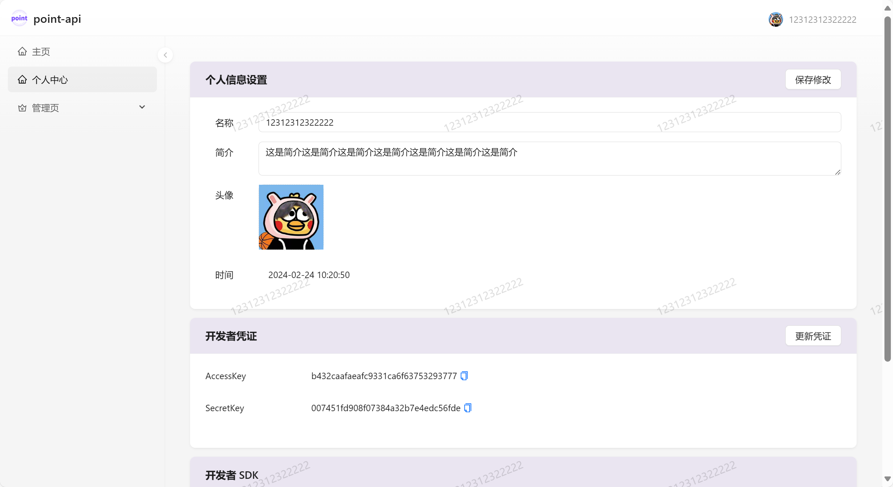

